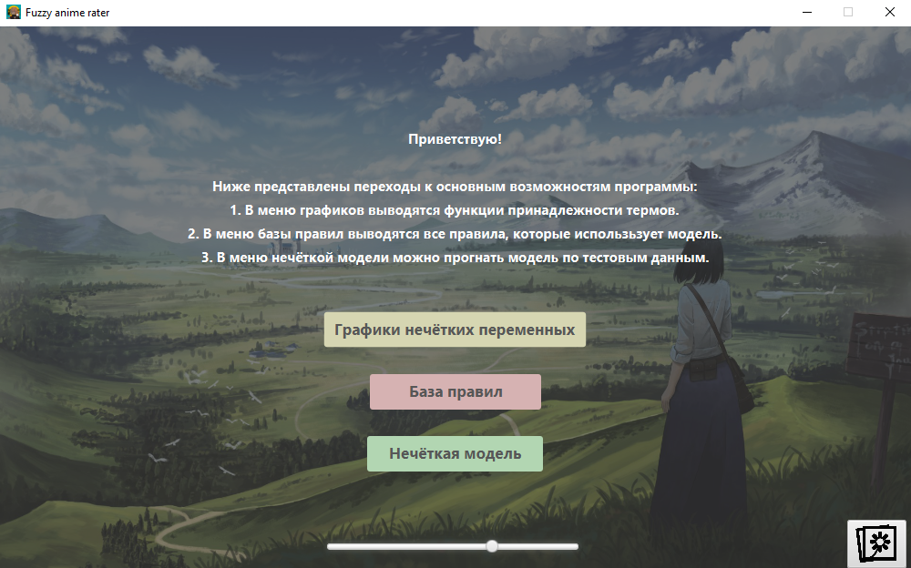
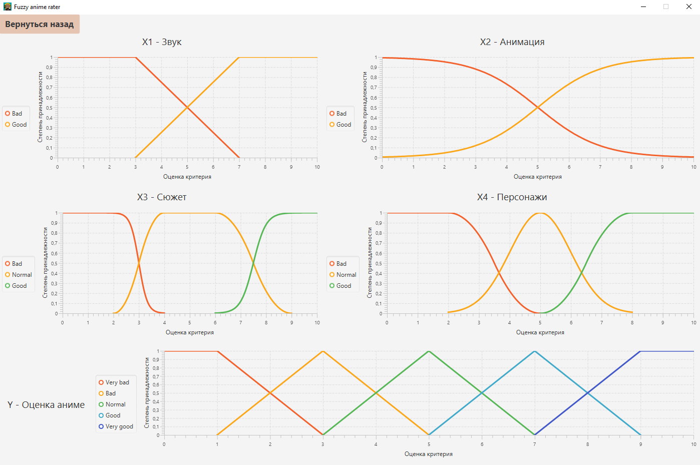
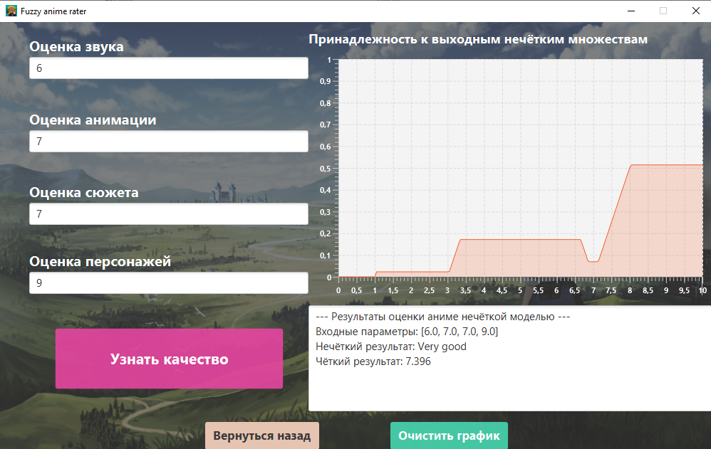

# Fuzzy Model Anime Rater

## Что это такое?
**Fuzzy Model Anime Rater** - это программа с графическим интерфейсом, которая позволяет на основе оценки критериев качества аниме получить его оценку.

Оценка производится с помощью *нечёткой модели*, находящейся внутри программы. 

## Как запустить?

### Запуск из консоли / ide
Для запуска программы без полноценной сборки исполняемого образа необходимо:
1. Убедиться, что на устройстве имеется **Maven** *не ниже версии 3.8.1* и **JDK** *не ниже версии 11*.
2. Скачать архив с исходными кодами / клонировать репозиторий.
3. Из корня скачанного проекта в командной строке / терминале вызвать команду `mvn javafx:run`.

### Сборка программы из исходных кодов

Для сборки программы из предоставленных исходников необходимо выполнить следующие действия:
1. Убедиться, что на устройстве имеется **Maven** *не ниже версии 3.8.1* и **JDK** *не ниже версии 11*.
2. Скачать архив с исходными кодами / клонировать репозиторий.
3. Из корня скачанного проекта в командной строке / терминале вызвать команду `mvn javafx:jlink`.

Как результат, в каталоге *.../FuzzyModel_Anime_Rater/target* появится папка *animerater* и архив *animeraterzip.zip* (они представляют из себя одно и то же, просто в 2-х форматах).

Для запуска собранной программы необходимо вызвать файл *.../FuzzyModel_Anime_Rater/target/animarater/bin/animefx.bat*

### Запуск с помощью архива в release на Github
Для пропуска первых 3-х шагов из предыдущего пункта можно просто скачать архив *animeraterzip.zip* из вкладки **Releses**.

В данном случае в наличии на устройстве **Maven** и **JDK** нет необходимости, так как архив представляет собой образ JRE (включает JVM и необходимые зависимости).

Для запуска программы необходимо извлечь все файлы из архива, после чего  вызвать файл *animaraterzip/bin/animefx.bat*.

## Возможности программы на текущий момент
1. Просмотреть характеристики используемой нечёткой модели: функции принадлежности входных переменных, базу правил.
2. Использовать нечёткую модель для вычисления общей оценки аниме с помощью оценивания критериев.
3. Изменить фоновое изображение (поддерживается и gif) и его затемнённость.

## Небольшие пояснения к критериям нечёткой модели
Сама по себе модель из-за своей универсальности не учитывает специфику каких-либо жанров, из-за чего результат, в конечно счёте, во многом зависит от оценок критериев пользователя.

Так, например, для жанра *«драма»* критерий качества анимации не столь сильно важен (по моему мнению), как, например, сюжет и персонажи, поэтому, если отнестись к второстепенным критериям более снисходительно, итоговая оценка будет выше.

1. *Оценка звука* - данным критерием описывается всё, что связано с музыкальным сопровождением картины.
2. *Оценка анимации* - данным критерием описывается внешний вид анимации, её качество, уникальность, стиль, использование некачественного 3д.
3. *Оценка сюжета* - данная характеристика является более комплексной и сложной, она включает: количество сюжетных дыр, их серьёзность для общего восприятии событий повествования, атмосферность и вовлеченность зрителя в происходящие события, количество шаблонных поворотов сюжетов, в том числе их обыгранность (например, некоторые клише можно очень интересно обыграть, из-за чего претензий к сценарному ходу не возникнет); наличие некой идеи в основе сюжета.
4. *Оценка персонажей* - данная характеристика также является довольно комплексной и включает: персонажи основные и второстепенные – их глубина проработанности, не шаблонность, логичность поведения, экспозиция и последующее развитие, внутренняя мотивация и влияние на сюжет. Также сюда относятся и диалоги между персонажами.

## Скриншоты выполнения программы

Главное окно программы

Вкладка с распределением входных лингвистических переменных

Пример вычисления оценки по критериям

